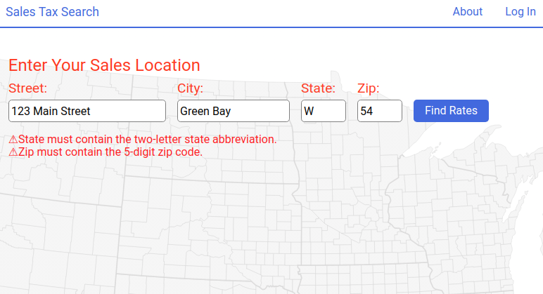

# Sales Tax Search

Sales Tax Search is a web application designed to assist tax preparers and
accountants with the often tedious task of looking up sales tax rates.

*This is the second version of the app. The first version does not use React or
any front-end frameworks or routing libraries. Here's the link to it: 
https://github.com/michaelsinghurse/sales-tax-search.*

## Architecture
The app was built with [Create React App](https://create-react-app.dev/). All
the HTML files are generated at build time with the `npm run build` command and
served from the `./client/build` folder. 

The server has three responsibilities: allow incoming requests to use the 
`./client/build` folder containing the static resources, respond to requests to 
the API endpoint for tax rates and political boundaries, and provide a catch-all 
response to all other requests by sending the `index.html` file. 

## Technical Challenges
### Validating Form Input
One challenge I faced was about how to validate form values. 

The code for the form can be found in `./client/src/SearchForm.js`.

React has the concept of "controlled component", which is a form element
whose value is controlled by React rather than the element itself. Instead of
a form element maintaining its own state internally, React maintains the state 
and renders it whenever the state changes. React is said to be the source of 
truth for the element.

Because React is maintaining the state of the form elements, I didn't rely on
browser form validation via the `pattern` or `required` attributes.

I went about validating the form inputs in two ways:

1. **On element change.** Whenever a form input element changes, I run the new 
value through a validation function. The validation function returns either an 
error message or an empty string (an empty string means that the value was 
valid). I then set the state of the React component with the new input value 
and the validation error message. If there was an error, it will be rendered 
directly below the form, as shown below.

Note: I should give credit here to Eric Bishard for his article about [React form
validation](https://www.telerik.com/blogs/up-and-running-with-react-form-validation). 
I leaned on it heavily to set up my validation logic and for rendering the error
message. 

2. **On form submit.** When the user submits the form, I prevent the default 
action of the browser handling the submit. I gather the value of every input 
element and run each of them through the validation function. If any of the 
values produce an error message, I set the state of the component with the new 
error messages and return immediately. I don't send a request to the server or 
reset the form. On the other hand, if all of the input values are valid, I send 
a fetch to the server for the tax rates and political jurisdictions for the address 
entered.

Once again, all my code for the form can be found in the file
`./client/src/SearchForm.js`.

### Setting up the Production Server

## Author
* Michael Singhurse
* michaelsinghurse@gmail.com
